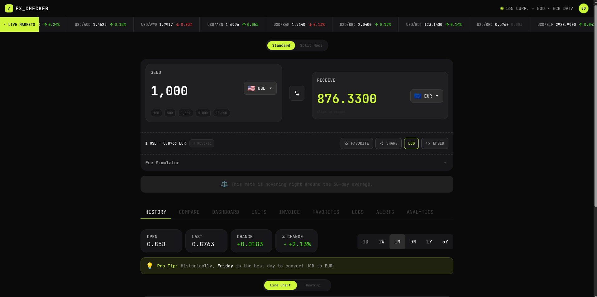
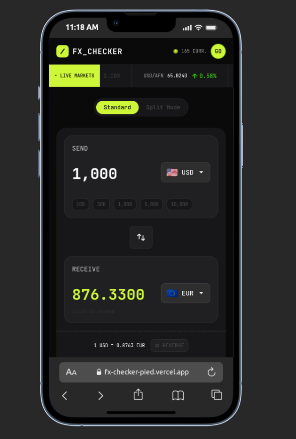

# FX Checker

A modern, institutional-grade foreign-exchange reference app built with Next.js and TypeScript. It goes well beyond a simple currency converter — offering live market tickers, historical analytics, a multi-currency dashboard, rate alerts, and professional-grade tools like a Big Mac Index calculator and correlation tracker.

## Live Demo

[Open the live app →](https://fx-checker-pied.vercel.app)

## Frontend Mentor

Frontend Mentor challenge: https://www.frontendmentor.io/challenges/foreign-exchange-currency-converter

## Screenshots

### Desktop View



### Mobile View



## Built With

- **Next.js 15** (App Router)
- **TypeScript** (strict mode)
- **Tailwind CSS v4**
- **Framer Motion** — page transitions, swap animations, spring pops, stagger reveals
- **Recharts** — interactive line and bar charts
- **Supabase** — Postgres + Auth + Row Level Security
- **React Query (TanStack Query v5)** — data fetching, caching, and mutation
- **Resend** — transactional welcome emails
- **Sonner** — toast notifications
- **Zod** — runtime input validation
- **Vercel Analytics** — production performance tracking

---

## Features

### 🔄 Currency Converter (Core)

The main converter supports two view modes:

- **Standard Mode** — Enter an amount, select a source and target currency, and see the converted result instantly. Flag emoji and full currency names appear alongside codes for clarity.
- **Split Mode** — Distribute a single amount across up to 5 target currencies at custom percentages. Each split card shows the converted value and its share of the total. An "Equalize %" button resets all splits to equal portions.
- **Reverse Mode** — Toggle `⇄ REVERSE` to flip the calculation direction — type how much you want to *receive* and see how much you need to *send*. The button highlights lime when active.
- **Quick Amount Buttons** — Pre-set chip buttons (100, 500, 1 000, 5 000, 10 000) instantly fill the amount field.
- **Conversion Insight** — An AI-style insight banner below the converter automatically compares the current rate against the 30-day average and 90-day high/low. It tells you whether now is a good or bad time to convert (e.g. "You're getting 1.3% more EUR than the 30-day average").
- **Fee Simulator** — Expand the collapsible fee panel to simulate flat or percentage broker fees. It shows the post-fee amount and deduction in real time, and remembers your last fee setting in `localStorage`.
- **Rate Source Banner** — A dismissible banner explains that rates come from Frankfurter (ECB reference data) and why broker quotes may differ. A "Show rate source info" button restores it after dismissal.

### 🌐 Live Markets Ticker

A scrolling marquee bar fixed below the header shows real-time FX rates for major pairs (USD, EUR, GBP crosses). Each pair displays its rate, a directional arrow (green/red), and the daily percentage change. The ticker uses an infinite-loop animation for a Bloomberg-terminal feel.

### 📊 Nine Tabbed Views

Below the converter, a 9-tab panel gives access to the full feature set. On desktop it renders as a horizontal tab bar with overflow scrolling; on mobile it collapses into an animated dropdown menu.

#### 1. History

- **Line Chart** — Interactive Recharts time-series chart for any currency pair across 6 time ranges: 1D, 1W, 1M, 3M, 1Y, and 5Y. The chart includes hover crosshairs for precise rate reading.
- **Heatmap View** — Toggle to a GitHub-style contribution heatmap where each day is color-coded by rate strength (red = weak, lime = strong). Hovering a cell shows the exact date and rate in a portal tooltip.
- **Summary Cards** — OPEN, LAST, CHANGE, and % CHANGE statistics recalculate when the time range changes, with stagger-in animations.
- **Volatility Tag** — A "Low / Medium / High Volatility" badge is computed from the standard deviation of historical rates and displayed on the chart header.
- **Best Day Insight** — For ranges ≥ 1M, a "Pro Tip" banner identifies which day of the week historically gives the best rate for the selected pair.

#### 2. Compare

A list of popular currencies showing the converted value, individual exchange rate, and 1-day and 30-day change badges with directional arrows. Each row has a star button to add the pair to Favorites.

#### 3. Dashboard

A paginated card grid showing all supported currencies (or popular-only with a toggle). Each card displays the flag, currency name, converted value, spot rate, and 1D/30D trend badges. Cards are sortable by name, rate, 1D change, or 30D change (ascending/descending). Each card includes a favorite button with a spring-pop animation.

#### 4. Units

A standalone unit converter for weight, distance, and temperature — separate from currency conversion. Select a category with pill tabs, choose units from custom dropdown menus, and get instant results with full swap and reverse support.

#### 5. Invoice

A multi-currency invoice calculator. Set a home currency and a client currency, then add line items (description + amount + currency) with the "+ Add Line Item" button. Each line item can be in a different currency. The calculator shows a "Total to Bill Client" in their currency and "Your Earnings (Home)" in yours, both computed through real exchange rates.

#### 6. Favorites *(requires login)*

Pinned currency pairs saved to your Supabase account. Each row shows the pair, its converted value, and daily trend. Click a favorite to load it into the converter. Remove pairs with the star button. The Favorites tab shows a badge count in the tab bar.

#### 7. Logs *(requires login)*

A chronological list of every conversion you've explicitly logged via the converter's "LOG" button. Each entry shows the timestamp (in relative format like "2h ago"), the currency pair, original amount, and converted amount. Features include:
- **Export CSV** — Download your entire log as a `.csv` file with date, currencies, and amounts.
- **Delete individual entries** or **Clear All** in one click.
- The Logs tab shows a badge count in the tab bar.

#### 8. Alerts *(requires login)*

Set rate alerts for any currency pair. Choose from/to currencies, pick "Above" or "Below", enter a target rate, and hit "Set Alert". Each alert shows its pair, condition, target, and a real-time status indicator:
- A pulsing amber dot for "WATCHING" alerts
- A green "TRIGGERED" badge when the rate crosses the threshold

Delete individual alerts with the trash button.

#### 9. Analytics

Four institutional-grade analytics tools in a 2×2 grid:

- **Currency Strength Index** — Ranks all currencies by their performance against a chosen base (e.g. USD). Shows the top 5 gainers and top 5 losers with their percentage change and current rate.
- **Big Mac Index** — Select a currency to see its implied PPP exchange rate based on local Big Mac prices vs. the US benchmark ($5.69). A visual gauge shows the over/undervaluation percentage.
- **90-Day Correlation Tracker** — Computes Pearson correlation coefficients across currency pairs over the last 90 days. Displays the top 5 positively correlated and top 5 inversely correlated pairs.
- **Recurring Conversion Tracker** — Simulate what a fixed monthly transfer (e.g. 500 USD → NGN) has been worth over the last 12 months. A color-coded bar chart shows months above/below average, with stats for latest, 12M average, best month, and total change.

### 🔐 Authentication

- **Supabase Auth** with email/password sign-up and login via a tabbed modal.
- **Auth Banner** — Unauthenticated users see a subtle prompt banner encouraging sign-up; it dismisses once logged in.
- **User Menu** — Logged-in users see their initials in a lime avatar button. The dropdown shows their name, email, a theme toggle, and a logout option.
- **Welcome Email** — On sign-up, a styled HTML welcome email is sent via Resend with the user's name and a CTA to start using the app.
- **Gated features** — Favorites, Logs, and Alerts require authentication. Clicking their action buttons while logged out opens the auth modal.

### 🎨 Theming

- **Light and Dark Mode** — A full class-based theming system using `next-themes`. All components, charts, cards, banners, scrollbars, and buttons adapt correctly.
- **Theme Toggle** — Available in the User Menu (authenticated) or as a standalone Sun/Moon button (unauthenticated).
- **Default Home Currency** — Set your preferred home currency via the "Set as Default" button on the converter's SEND panel. It persists in `localStorage` and loads automatically on future visits.

### ⌨️ Keyboard Shortcuts

Press `?` anywhere in the app to open the shortcuts modal.

| Key | Action |
|-----|--------|
| `/` | Focus the amount input |
| `S` | Swap currencies |
| `X` | Clear the amount |
| `R` | Toggle reverse mode |
| `1` – `6` | Switch chart time range (1D through 5Y) |
| `?` | Open/close shortcuts modal |

All shortcuts are disabled when focus is inside a text input or `<select>`.

### 🔗 Sharing & Embedding

- **URL-Synced State** — The converter's from/to currencies and amount are synced to the URL query string in real time (`?from=USD&to=EUR&amount=1000`). This means every conversion is a shareable, bookmarkable link.
- **Share Button** — Uses the Web Share API on mobile (native share sheet) with an automatic clipboard-copy fallback on desktop.
- **Embed Modal** — Generate an `<iframe>` snippet to embed a fully functional mini converter widget on any website. The embed page (`/embed`) renders a self-contained converter with a "Powered by FX Checker" footer.

### 🌐 Offline Support

- On successful API fetch, rates are cached in `localStorage` with a timestamp.
- When offline, the app falls back to cached rates and shows an `OfflineBanner` with the cache age so users know how stale the data is.

### ♿ Accessibility

- Semantic HTML throughout (`<main>`, `<nav>`, `<section>`, ARIA roles on tabs and dropdowns).
- All interactive elements are keyboard-reachable with visible focus rings.
- Tab dropdowns and modals use `role="menu"`, `aria-expanded`, and keyboard navigation (`Enter`/`Space`).
- Color is never the only indicator — trend badges use icons alongside color.
- The shortcuts help button is fixed on the left edge of the viewport for easy discovery.

### 🚀 Performance & SEO

- **Skeleton loaders** on every data-dependent component — no blank states or layout shifts.
- **Lazy-loaded charts** — Recharts components are dynamically imported with `ssr: false`.
- **React Query caching** — 1-hour stale time for rates, 24-hour for history.
- **Google Fonts via `next/font`** with `display: swap` for zero flash of unstyled text.
- **Full SEO** — Open Graph images, Twitter cards, JSON-LD structured data, `robots.ts`, and `sitemap.ts`.
- **Vercel Analytics** integrated for production performance monitoring.

### ✨ Animations (Framer Motion)

- Swap button flip animation
- Spring-pop on favorite/unfavorite
- Stagger-in for list items and grid cards
- Slide-up entrance for sections and tabs
- Chart reveal animation with clip-path
- Infinite slider for the live markets ticker
- Smooth tab-switching with animated active pill indicator
- All animations respect `prefers-reduced-motion`

---

## Local Setup

1. Clone the repository.

```bash
git clone https://github.com/ShinobiKoda/fx_checker.git
cd fx_checker
```

2. Install dependencies.

```bash
npm install
```

3. Create a `.env.local` file in the project root with the required keys.

Example `.env.local`:

```env
NEXT_PUBLIC_SUPABASE_URL=your_supabase_url
NEXT_PUBLIC_SUPABASE_ANON_KEY=your_supabase_anon_key
RESEND_API_KEY=your_resend_api_key
```

Optional (welcome email rate limiting):

```env
UPSTASH_REDIS_REST_URL=your_upstash_url
UPSTASH_REDIS_REST_TOKEN=your_upstash_token
```

4. Start the development server.

```bash
npm run dev
```

5. Open the app at http://localhost:3000.

## Available Scripts

- `npm run dev` — starts the local development server
- `npm run build` — creates a production build
- `npm run start` — runs the production server
- `npm run lint` — runs ESLint

## Notes on Data & Deployment

- Rates are pulled from Frankfurter (ECB reference rates). This is a reference data source; broker quotes may differ due to spreads, fees, execution timing, liquidity, and market volatility.
- The project is deployed on Vercel; ensure required environment variables are added in your deployment target.
- All API requests go through Next.js route handlers (`/app/api/`) — the client never calls Frankfurter directly.
- User data (favorites, logs, alerts) is stored in Supabase Postgres with Row Level Security ensuring users can only access their own data.

## Learning Journal — Frontend Mentor scope

What I implemented for the Frontend Mentor requirements

- Core conversion UI with keyboard shortcuts, swap/reverse, and URL-synced state.
- Rate display and offline fallback using cached Frankfurter rates.
- A compact, dismissible banner that explains the rate source and why broker quotes may differ.
- Share flow using the Web Share API with a clipboard fallback for safety.

What I learned while building this

- UX matters: small touches (dismissible info, accessible buttons, keyboard shortcuts) significantly improve perceived polish.
- Progressive enhancement: using `navigator.share()` with a clipboard fallback keeps the share feature robust across devices.
- Theming and contrast need iteration — ensuring buttons and banners are accessible in both light and dark modes required a couple of styling passes.
- Building institutional-grade analytics (correlation, Big Mac PPP, strength indices) from a free public API is entirely feasible — the data pipeline from Frankfurter's timeseries endpoint is powerful.

What I would change next / continued development

- Add a provider abstraction so the app can swap between Frankfurter, other public APIs, and broker feeds with clear fallbacks and feature flags.
- Extract common UI bits (info banner, small utility buttons) into shared components to avoid duplication and speed future styling changes.
- Add visual regression tests or Storybook to validate light/dark contrasts automatically.

## Contributing

PRs and issues are welcome. If you make visual or theme changes, please include screenshots for both light and dark mode.

## License

MIT
